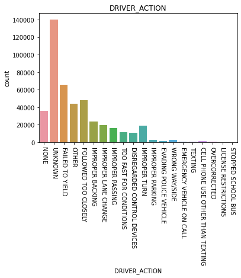
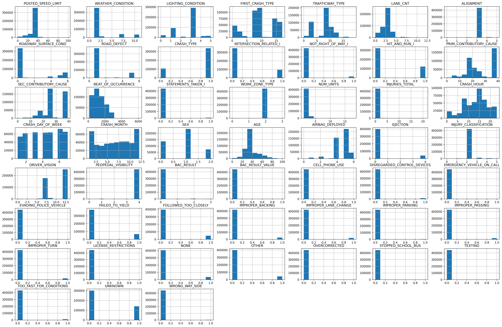
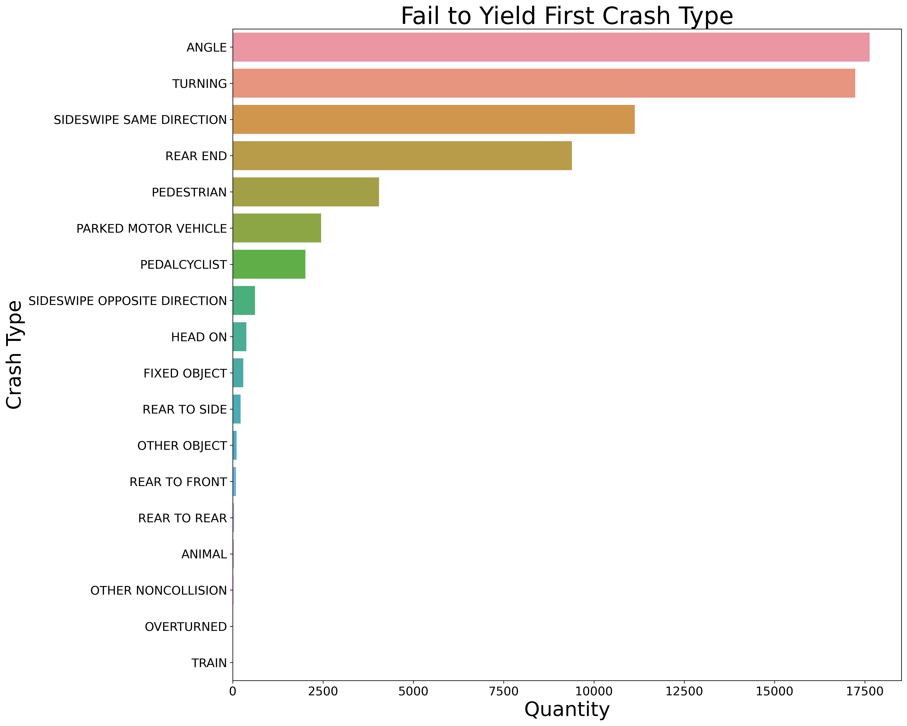
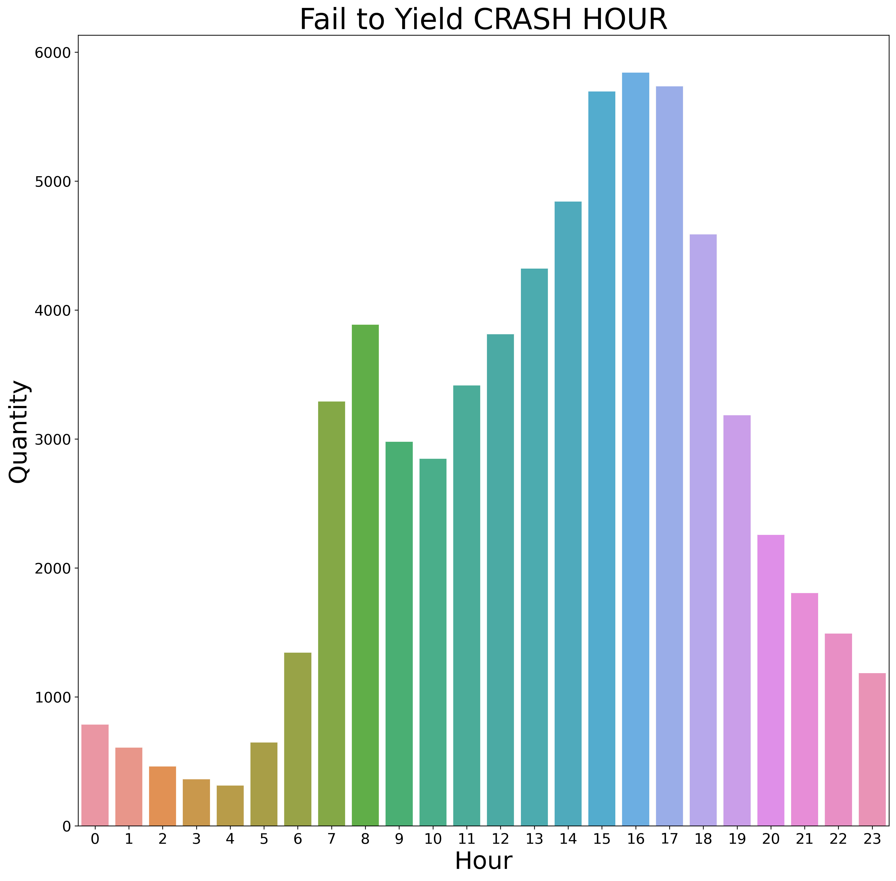
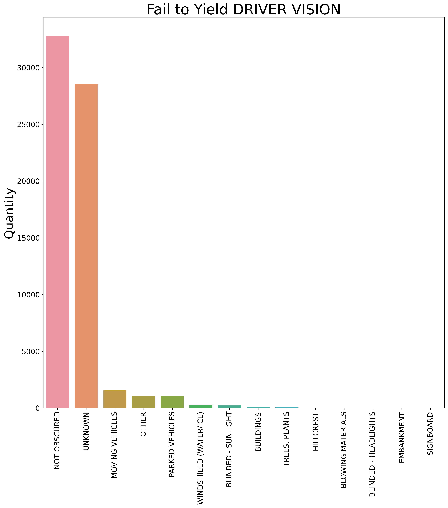
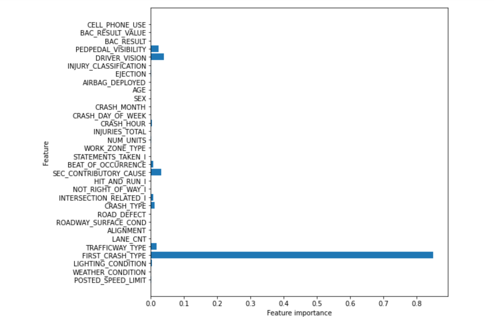

## Business Case

Using the City of Chicago Traffic Crashes dataframe, we are going to model the data to try to answer the following questions:

- Primary causes of car crashes in the Chicago Area
- Main types of car crashes
- What can drivers do to prevent crashes?

Focus in this analysis:
- Use a model to predict whether the main cause of crash was driver’s failure to yield


## Methodology:
1. Obtain and merge the traffic crash data from the Chicago Data Portal regarding the crashes and the people 
2. Examine and Scrubbing the data to prepare it for modeling
3. Exploration of the data
4. Perform and evaluate a baseline model of the data
5. Perform and evaluate other models of the data and decide which to use
6. Interpretations and recommendations based on the models and examination of the data.
7. Future work 


## Obtain the Data

Importing, merging, and initial look at the data


```python
# Import pandas and data set
import pandas as pd
crash_df = pd.read_csv('Traffic_Crashes_-_Crashes.csv')
people_df = pd.read_csv('Traffic_Crashes_-_People.csv')
```


```python
# merge the two datasets into one
crash_df = pd.merge(crash_df, people_df, on='CRASH_RECORD_ID', how='left')
```


### Column Names and Descriptions

**POSTED_SPEED_LIMIT**	
Posted speed limit, as determined by reporting officer

**WEATHER_CONDITION**	
Weather condition at time of crash, as determined by reporting officer

**LIGHTING_CONDITION**	
Light condition at time of crash, as determined by reporting officer

**FIRST_CRASH_TYPE**	
Type of first collision in crash

**TRAFFICWAY_TYPE**	
Trafficway type, as determined by reporting officer

**LANE_CNT**	
Total number of through lanes in either direction, excluding turn lanes, as determined by reporting officer (0 = intersection)

**ALIGNMENT**	
Street alignment at crash location, as determined by reporting officer

**ROADWAY_SURFACE_COND**	
Road surface condition, as determined by reporting officer

**ROAD_DEFECT**	
Road defects, as determined by reporting officer

**CRASH_TYPE**	
A general severity classification for the crash. Can be either Injury and/or Tow Due to Crash or No Injury / Drive Away

**INTERSECTION_RELATED_I**	
A field observation by the police officer whether an intersection played a role in the crash. Does not represent whether or not the crash occurred within the intersection.

**NOT_RIGHT_OF_WAY_I**	
Whether the crash begun or first contact was made outside of the public right-of-way.

**HIT_AND_RUN_I**
Crash did/did not involve a driver who caused the crash and fled the scene without exchanging information and/or rendering aid

**DAMAGE**	
A field observation of estimated damage.

**PRIM_CONTRIBUTORY_CAUSE**	
The factor which was most significant in causing the crash, as determined by officer judgment

**SEC_CONTRIBUTORY_CAUSE**	
The factor which was second most significant in causing the crash, as determined by officer judgment

**BEAT_OF_OCCURRENCE**	
Chicago Police Department Beat ID. Boundaries available at https://data.cityofchicago.org/d/aerh-rz74

**STATEMENTS_TAKEN_I**	
Whether statements were taken from unit(s) involved in crash

**WORK_ZONE_TYPE**	
The type of work zone, if any

**NUM_UNITS**	
Number of units involved in the crash. A unit can be a motor vehicle, a pedestrian, a bicyclist, or another non-passenger roadway user. Each unit represents a mode of traffic with an independent trajectory.

**CRASH_HOUR**	
The hour of the day component of CRASH_DATE.

**CRASH_DAY_OF_WEEK**	
The day of the week component of CRASH_DATE. Sunday=1

**CRASH_MONTH**	
The month component of CRASH_DATE.

**SEX**	
Gender of person involved in crash, as determined by reporting officer

**AGE**	
Age of person involved in crash

**AIRBAG_DEPLOYED**	
Whether vehicle occupant airbag deployed as result of crash

**EJECTION**	
Whether vehicle occupant was ejected or extricated from the vehicle as a result of crash

**INJURY_CLASSIFICATION**	
Severity of injury person sustained in the crash

**DRIVER_ACTION**	
Driver action that contributed to the crash, as determined by reporting officer

**DRIVER_VISION**	
What, if any, objects obscured the driver’s vision at time of crash

**PHYSICAL_CONDITION**	
Driver’s apparent physical condition at time of crash, as observed by the reporting officer

**PEDPEDAL_VISIBILITY**	
Visibility of pedestrian of cyclist safety equipment in use at time of crash

**BAC_RESULT**	
Status of blood alcohol concentration testing for driver or other person involved in crash

**BAC_RESULT VALUE**	
Driver’s blood alcohol concentration test result (fatal crashes may include pedestrian or cyclist results)

**CELL_PHONE_USE**	
Whether person was/was not using cellphone at the time of the crash, as determined by the reporting officer


## Scrubbing and exploring the data

The process of scrubbing the dataset included: 

1. Removing all duplicate crashes based on the unique crash_ID

2. Dropping columns that would not be beneficial to the model or had similar data to other columns used.

3. Dealing with null values
   - Object null values were either dropped, filled with their verison of 'NO', or filled with "UNKNOWN" based on the unique values in each column.
   - Numerical null values were either dropped, filled with 0, filled with the mean, or filled with the mode based on the unique values and make up of each column.
   
4. Once all the scrubbing was completed, the final shape of the dataframe was (442956, 34)


The process of exploring the dataset included:

1. Creating functions to streamline plotting data.

```python
# Function to graph bar chart
def bar_plot(col, target, df):
    """Creates bar plot against target variable and saves plot as png
    to figures folder"""
    ax = sns.barplot(y=df[target], x= df[col], orient='h', data=df)
    ax.set_title(f"{col} vs {target}")

    # Save image as png
    plt.savefig(f'figures/bar_{col}_v_{target}.png', transparent=True, bbox_inches='tight');
```


```python
# Function to graph a count plot
def count_plot(df,col):
    """Creates boxplot of a column and saves plot as png to figures folder"""
    ax = sns.countplot(x=df[col], data=df)
    ax.set_title(f"{col}")
    plt.xticks(rotation=270)
    
    # Save image as png
    plt.savefig(f'figures/count_{col}.png', transparent=True, bbox_inches='tight');
```


```python
def scatter_plot(col,target,df):
    """Creates a scatterplot of a column against target variable with a hue of
    crash type and saves plot to figures folder."""
    
    ax = sns.scatterplot(data=df, x=df[col], y=df[target])
    ax.set_title(f"{col} v {target}")
     # Save image as png
    plt.savefig(f'figures/scatter_{col}_v_{target}.png', transparent=True, bbox_inches='tight');
```

2. The examination of the count plots for the categorical columns helped decide that the focus should be on Driver_Action. 





3. Driver_action was One-Hot Encoded and the other object columns were LabelEncoded


```python
feats = ['DRIVER_ACTION']
```


```python
encode_df = pd.get_dummies(crash_df, drop_first=True, columns=feats)
encode_df.info()
```


```python
# Using for loop to loop through object_col and Assign numerical values 
# and storing in another column
for col in object_col:
    encode_df[col] = labelencoder.fit_transform(encode_df[col])

encode_df.head()
```


4. Histograms of numerical columns were made.





5. Barplots and scatterplots were made to get a better idea of the breakdown of the data and helped narrow down the target to Failed to Yield. 











## Models for Target: FAILED TO YIELD


Functions to help ease the process of creating multiple models. 


```python
# Function to print scores
from sklearn.metrics import precision_score, recall_score, accuracy_score, f1_score, confusion_matrix
def print_metrics(labels, preds, time):
    """input (labels, preds) and prints Precision score, Recall score,
    Accuracy score, F1 score, and Confusion matrix"""
    print("Precision Score: {}".format(precision_score(labels, preds)))
    print("Recall Score: {}".format(recall_score(labels, preds)))
    print("Accuracy Score: {}".format(accuracy_score(labels, preds)))
    print("F1 Score: {}".format(f1_score(labels, preds)))
    print("Confision Matrix: \n{}".format(confusion_matrix(labels, preds)))
    print("\n Run Time: {}".format(time))
```


```python
def print_tree(dt, feature_name, save_file):
    """function to print and save the Decision Tree printout"""
    dot_data = tree.export_graphviz(dt, 
                  feature_names=feature_name,    
                  filled=True, rounded=True,  
                  special_characters=True,
                  out_file=None)
            
    graph = graphviz.Source(dot_data)

    graph.format = "png"
    graph.render(f'figures/{save_file}')
    return graph.view()
```


```python
def plot_feature_importances(model):
    """Plots feature importance"""
    n_features = X_train.shape[1]
    plt.figure(figsize=(8,8))
    plt.barh(range(n_features), model.feature_importances_, align='center') 
    plt.yticks(np.arange(n_features), X_train.columns.values) 
    plt.xlabel('Feature importance')
    plt.ylabel('Feature')
```


The data was then Train-Test_Split and scaled using StandardScaler


### Baseline model: Dummy Classifier

Dummy Classifier was used as the baseline model due to its speed and simplicity. It makes predictions based on simple rules. In this case, it made prediction based on class by using the strategy 'stratified.'


```python
# generates random predictions by respecting the training set class distribution.
from sklearn.dummy import DummyClassifier
```


```python
start = time.time()

# Instantiate 
clf = DummyClassifier(strategy='stratified', random_state=0)

# Fit the Classifier
clf.fit(X_train, y_train)
DummyClassifier(random_state=0, strategy='stratified')
clf.score(X_test, y_test)

# Predict on the test set
y_preds = clf.predict(X_test)

end = time.time()
dum_n = end - start
print(f'time: {dum_n}')
```

The scores with the Dummy Classifier are low, which was to be expected. There is a very high false positive rate. 

*Results:*
 
Precision Score: 0.7461035884358053
Recall Score: 0.7469826184367434
Accuracy Score: 0.7469826184367434
F1 Score: 0.7465423102142656

Confision Matrix: 


|             |                       _Actual_         |
| :---------- | :---------: | :---------: | ---------: |
|             |             | *Postive*   | *Negative* |
|             | :---------: | :---------: | ---------: |
| _Predicted_ | *Postive*   |  80212      |  13934     |
|             | :---------: | :---------: | ---------: |
|             | *Negative*  |  14073      |  2473      |


 Run Time: 0.07404804229736328


### Final model: Decision Tree

Decision trees break data into smaller subsets based on feature importance. Unlike distance based models with a dataset this large, it will not take hours to run.


```python
plot_feature_importances(dt_model)
```




```python
start = time.time()

# Train a Decesion Tree
dt_model = DecisionTreeClassifier(random_state=10, max_depth=5)  
dt_model.fit(X_train, y_train) 

# Make predictions for test data
y_pred = dt_model.predict(X_test)

end = time.time()
dt_n = end - start
dt_n
```

The results of this model were much better than the baseline model especially with the false negatives. 

```python
print_metrics(y_pred, y_test, dt_n)
```

- Precision Score: 0.8579048
- Recall Score: 0.99092898
- Accuracy Score: 0.8526903479926282
- F1 Score: 0.91963133
- Confision Matrix: 

<table>
<thead>
<tr><th></th><th>Actual</th><th></th></tr>
</thead>
<tbody>
    
<tr><td></td><td></td><td>Positive</td><td>Negative</td></tr>
    
<tr><td>Predicted</td><td>Postiive</td><td>93292</td><td>854</td></tr>

<tr><td></td><td>Negative</td><td>15452</td><td>1094</td></tr>


</tbody>
</table>
     

There are two precision, recall, and F1-Score. The second number listed does not take into account the class imbalance. The first score is weighted to take the class imbalance into account. 

### Recommendations

In driver education classes:
- Focus more on the importance of yielding especially when turning, changing lanes, and with pedestrians present

- Rush hour when everyone is in a rush to get to work/get home is the time to be extra cautious 

For filling in crash reports:
 - Since most of the data is based on the determination of the reporting officer, having universal language would help repetitive data and multiple inputs meaning the same thing. ie the Hospital column having over 25 ways that "Refused Medical Attention" was inputted. 
 
 
 
#### Recommended Future Work 

- Examine how other action and causes affect the models
- Add the third linked dataframe covering the cars involved to go more in depth.

- Streamline the data:
 - Research the differences in crashes, causes, etc. Example: not yielding to parked vehicle? 
 - Combine like columns, rows based on the research
 - Binning and cluster data 
- Run other models that take longer to run


